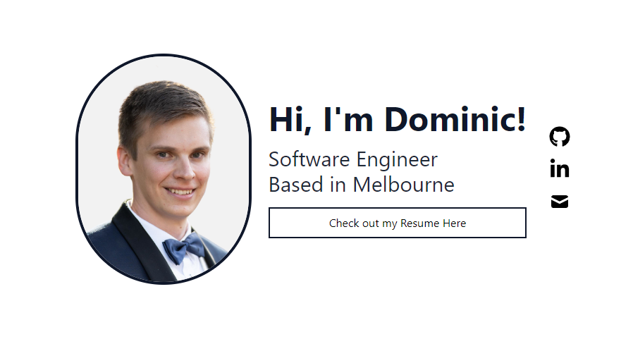
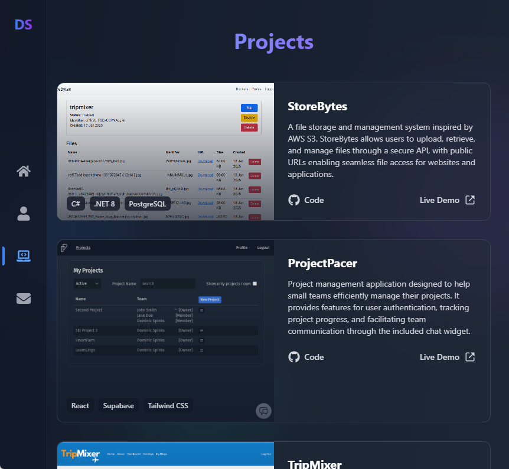

# Dominic Spinks Portfolio

Welcome to my personal portfolio website! This project showcases my skills, projects, and experiences as a developer. Built with React and Typescript, styled using Tailwind CSS, the website is designed to be clean, responsive, and easy to navigate.

## Features

-   **Responsive Design**: Ensures compatibility with various devices and screen sizes.
-   **Project Showcase**: Displays a collection of my best projects with descriptions and links.
-   **About Me**: Provides an overview of my background, skills, and interests.
-   **Contact Form**: Allows visitors to get in touch with me easily.

## Technologies Used

-   **Frontend**:

    -   React
    -   Typescript
    -   Tailwind CSS
    -   EmailJS

-   **Build Tools**:
    -   Vite
    -   PostCSS

## Screenshots

## Contact

If you have any questions or would like to get in touch, feel free to reach out to me at [dominic.spinks@outlook.com](mailto:dominic.spinks@outlook.com), connect with me on [LinkedIn](https://www.linkedin.com/in/dominicspinks/) or check out my other projects here on [GitHub](https://github.com/dominicspinks).

---

Thank you for visiting my portfolio! I hope you enjoy exploring my work.
